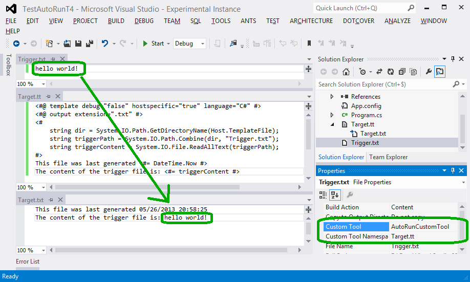

AutoRunCustomTool
=================

A Visual Studio extension that automatically runs the custom tool on another file when a file is modified

OK, I realize that this description is perhaps not very clear, so let's take an example. Let's assume (well, it's not really an assumption; it's actually the scenario that caused me to create this tool) that in your project, you can't (or don't want to) use the default custom tool for resx resource files. Instead, you use a T4 template to generate the code associated with the resx file. So you have 3 files :

- *Strings.resx*, that contains the actual string resources
- *Strings.tt*, a T4 templates that generates code to access the resources from *Strings.resx*
  - *Strings.cs*, a C# source file that is generated by *Strings.tt* based on the content of *Strings.resx*

The problem with this setup is that Visual Studio doesn't know that a change to *Strings.resx* should cause a regeneration of *Strings.cs*, so when you just added a resource to the resx file, it's not immediately available to your code, and doesn't appear in Intellisense. You have to right-click *Strings.tt* and select "Run custom tool" so that the template is run again. This is *very* annoying...

This VS extension solves the problem very simply: when it detects a change to the "trigger" file (*Strings.resx*), it reruns the custom tool for the "target" file (*Strings.tt*).

Note that this was just an example; the trigger file doesn't have to be a resx file, and the "target" file doesn't have to be a T4 template. Both can be anything you want, as long as the target has a custom tool defined.

How to use
----------

Basically, all you have to do is set the *Custom Tool* for the trigger file to "AutoRunCustomTool", and set the *Custom tool namespace* to the name of the target file. That's it!

Here's a screenshot that shows how it works:

