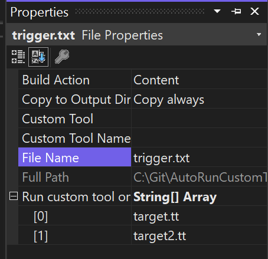

# Sample: ClassicProject

This project contains:

- A "trigger" file: `trigger.txt`
- Two "target" T4 templates: `target.tt` and `target2.tt`

The T4 templates use the content of `trigger.txt` to generate two other text files (`target.txt` and `target2.txt`).

The trigger file is configured so that any change to this file causes the T4 templates to regenerate their output. In "classic" projects (pre .NET Core format),
this configuration is done via the Properties UI by setting the "Run custom tool on" property:

